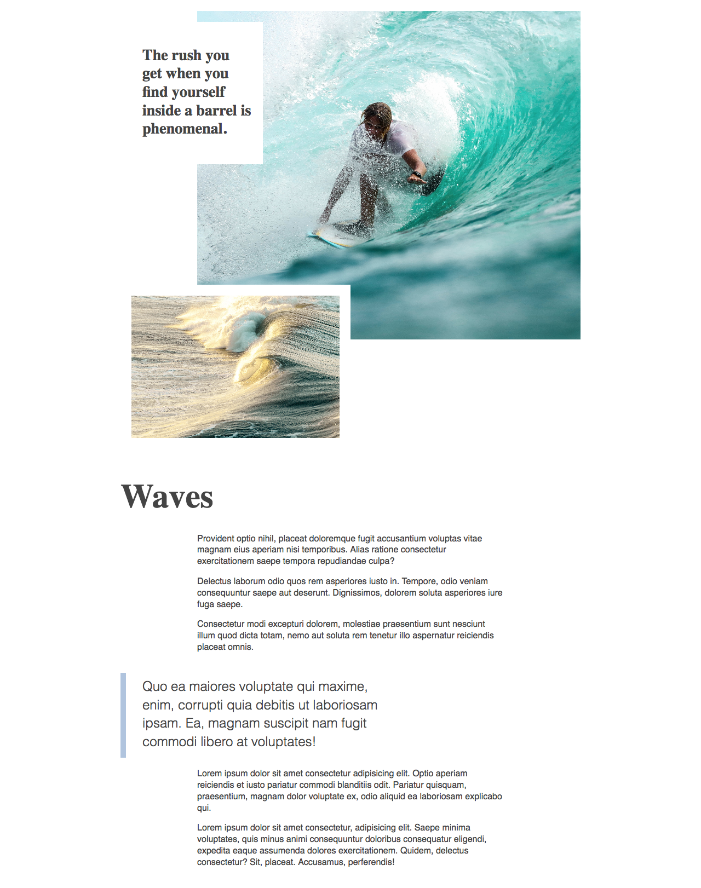
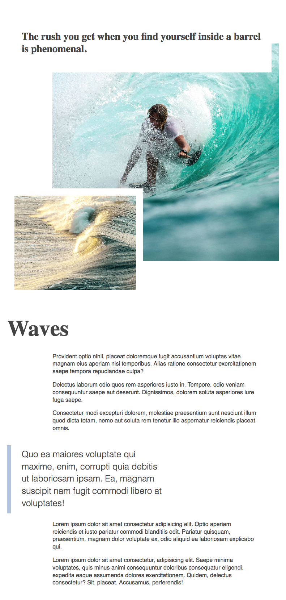
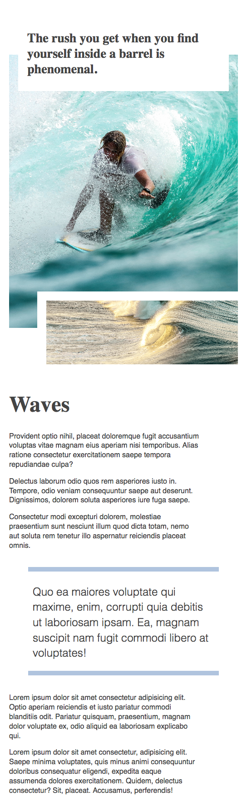

# CSS Grid layout

Let's create a responsive article layout with CSS Grid.

Have a look at the desktop version:

Have a look at the tablet version:

Have a look at the mobile version:

Mobile first or desktop first is up to you.

### Hint

You need to define two grid containers: one for the hero, and one for the content.

The content grid does not need any rows, since we want the content to flow as it normally would.

The hero grid should take up about `800px` in height, so we could use this number to define how many and how high rows we need.
